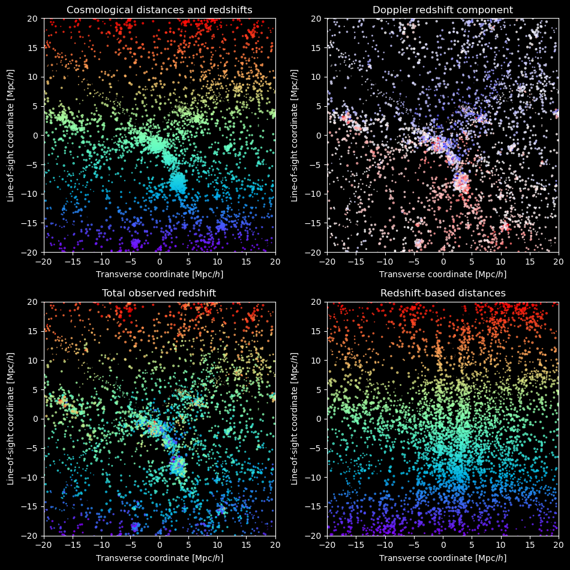

## Outreach

I have been working on more accurate scientific visualizations for [Dark Energy Spectroscopic Instrument (DESI)](https://desi.lbl.gov) science to bridge the gap between the simplified demonstrations and publication-level specialized plots for the more curious or knowledgeable public, aspiring scientists, etc.

### Visualizations for redshift-space distortions

I decided to use data from simulations to show our understanding of the redshift-space distortions more faithfully than we can with approximations using real DESI data. 
The following visuals use an [AbacusHOD](https://abacusutils.readthedocs.io/en/latest/hod.html) galaxy catalog for DESI Bright Galaxy Survey (BGS) based on one of the [AbacusSummit](https://abacussummit.readthedocs.io) N-body (dark matter-only) simulations.

Initially, I helped [Claire Lamman](https://cmlamman.github.io) create [the animation](https://www.youtube.com/watch?v=AgX3lZEr240) for [the November 2024 DESI press release](https://newscenter.lbl.gov/2024/11/19/new-desi-results-weigh-in-on-gravity/).

In this page, I focus on further versions, which are more nuanced and probably require a deeper involvement.
They were made using fragments of Claire's code, and were improved using feedback from her, Daniel Eisenstein and other members of his group at Harvard/Center for Astrophysics, particularly Catherine Miller, who suggested to represent redshifts with rainbow colors.

#### Animation with coloring by peculiar velocities

This animation highlights the peculiar velocities as the cause for the difference between the true positions (real space) and the redshift-based positions (redshift space).
Galaxies colored in red are moving up (away from the observer far below), in blue — down (towards the observer).
They shift in the same direction when the slider goes up (from true to redshift-based positions).
The colors give cues where to expect differences.
This allows to see not only the more prominent Fingers of God (elongation along the line of sight) on small scales, but also the subtler Kaiser effect ("pancakes of God", flattening along the line of sight) on larger scales.

Here I provide two versions with different opacities for galaxies, which can aim for different presentation circumstances (e.g. LCD screen vs projector):

<table>
<tr>
<td markdown="1">

[Video (mp4) format](files/outreach/RSD/RSD_1panel_high_opacity.mp4)
</td>
<td markdown="1">

[Video (mp4) format](files/outreach/RSD/RSD_1panel_low_opacity.mp4)
</td>
</tr>
</table>
Credit: M. Rashkovetskyi, C. Lamman, C. Miller, D. Eisenstein (DESI collaboration)

#### Static step-by-step explanation

This version is zoomed in further to make the changes more noticeable.

<table>
<tr>
<td markdown="1">

Credit: M. Rashkovetskyi, C. Lamman, C. Miller, D. Eisenstein (DESI collaboration)
</td>
<td markdown="1">

Top left: true/cosmological distances for the vertical coordinate, the color encodes cosmological redshifts (1-to-1 correspondence between the two — purely vertical color gradient).

Top right: the same coordinates; color encoding velocities contributing to the total observed redshift via the Doppler effect.

Bottom left: the same coordinates; color encoding the total observed redshift.

Bottom right: the same color (total observed redshift), but distances are recomputed based on the total observed redshift (so the color gradient is purely vertical again).

We typically can not disentangle the cosmological redshift from Doppler, thus in most cases we can only see the bottom right picture.
</td>
</tr>
</table>

#### Extended animation

In the top panel, the galaxies are colored by redshift, in the bottom one — by peculiar velocities.
Both use the same positions.
I introduced an additional transition between cosmological-only redshifts and total redshifts (including the Doppler effect from peculiar velocities), it only affects the colors in the top panel and is more subtler than the position shift.

Credit: M. Rashkovetskyi, C. Lamman, C. Miller, D. Eisenstein (DESI collaboration)

[Video (mp4) format](files/outreach/RSD/2panels_extended.mp4)
